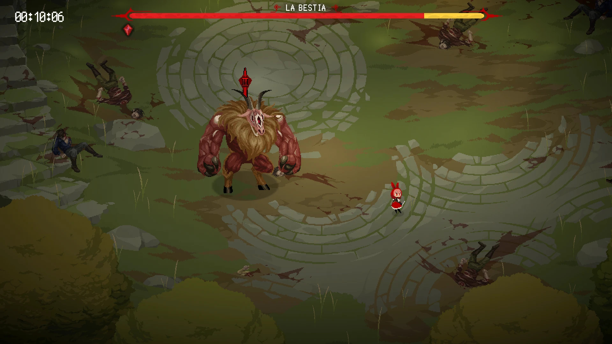

# Rubinite: vista previa del daño en la barra del jefe

En [Rubinite](https://store.steampowered.com/app/1845250/Rubinite/) vas acumulando marcas en el jefe con la Concentración, y la Estocada hace más daño cuantas más marcas tenga. Pero si te golpean, las pierdes todas.

Este mod muestra en la barra de vida del jefe, con un tramo **amarillo** parpadeante, la vida que le quitarías si lanzas la Estocada en ese momento, como en otros juegos. El tramo crece con cada marca y desaparece en cuanto te golpean.

El daño no es un cálculo aproximado mío: se usa la misma fórmula que el juego usa al golpear. Incluye las mejoras de Estocada, los talismanes y la menor resistencia de los jefes en la segunda vuelta. Si llevas el talismán *Maestría de Marcas*, muestra el daño de una sola marca, que es lo que hace el golpe.

## Cómo instalar

1. Descarga `DamagePreview-v1.0.zip` de la [última versión](../../releases/latest) y descomprímelo.
2. Cierra el juego, abre `DamagePreview.exe` y elige la opción **1**. Deja los archivos que vienen en el .zip juntos en la misma carpeta.

El programa encuentra el juego solo. Si no lo detecta, arrastra la carpeta del juego encima del .exe.

Windows puede mostrar el aviso de "Windows protegió tu PC" porque el programa no está firmado; dale a *Más información* y luego a *Ejecutar de todas formas*.

**Para quitarlo:** abre el programa otra vez y elige la opción **2**, o verifica los archivos del juego desde Steam.

**Si el juego se actualiza** y la vista previa deja de salir, solo abre el programa de nuevo.

> Después de terminar la primera vuelta, el juego oculta la barra de los jefes. Para ver la vista previa en la segunda vuelta necesitas también [Barra de vida de los jefes siempre visible](https://github.com/Vizpok/rubinite-boss-health-bar).

## Qué cambia

- Copia `RubiniteDamagePreview.dll` en `Rubinite_Data/Managed`. Ese archivo dibuja el tramo amarillo.
- Añade una llamada a ese archivo al principio de `BossUI.Update` en `Assembly-CSharp.dll`.

Al desinstalar se quitan las dos cosas. Se puede usar junto con la [traducción al español](https://github.com/Vizpok/rubinite-spanish-translation) y la barra siempre visible sin que se pisen.

Detalles:
- Solo cuenta el daño de la Estocada. El extra de la Estocada Explosiva, que se detona después, no se muestra.
- En jefes con varias partes que marcar, se usa la que estás enfocando.

## Compilar

El código está en `src/`. Con el compilador de C# que ya trae Windows (.NET Framework 4) y `Mono.Cecil.dll` en la misma carpeta, ejecuta `compilar.bat` indicando la carpeta del juego. Genera `DamagePreview.exe` y `RubiniteDamagePreview.dll`, que se distribuyen junto con `Mono.Cecil.dll`.

## Licencias

El instalador usa [Mono.Cecil](https://github.com/jbevain/cecil) (licencia MIT, ver `LICENCIAS-TERCEROS.txt`).

---

Mod hecho por un fan, sin relación con los desarrolladores. Aquí no se incluye ningún archivo del juego; necesitas tenerlo comprado para usarlo.
